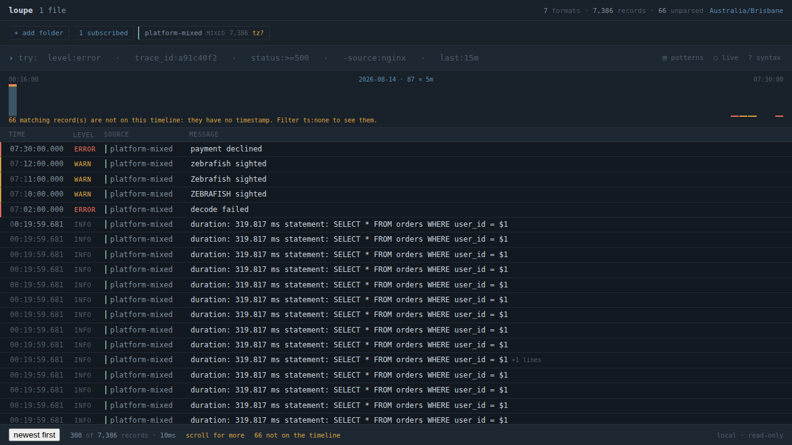
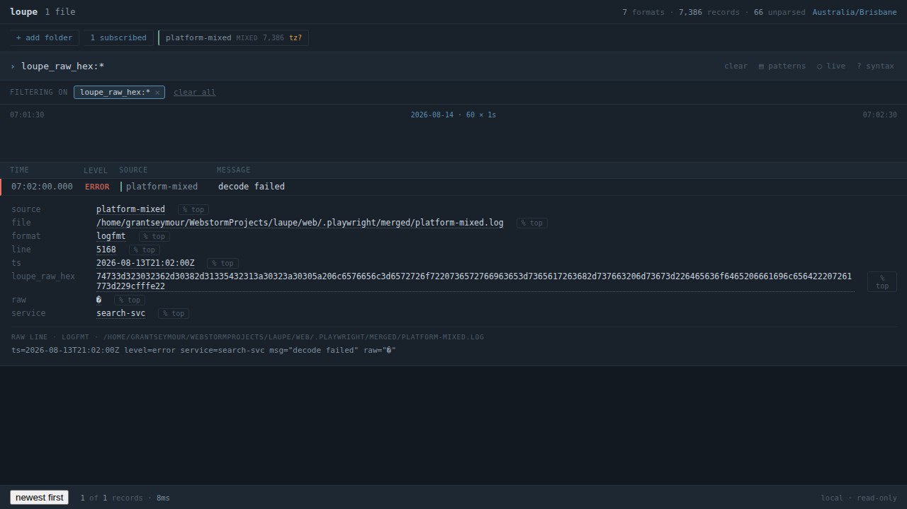
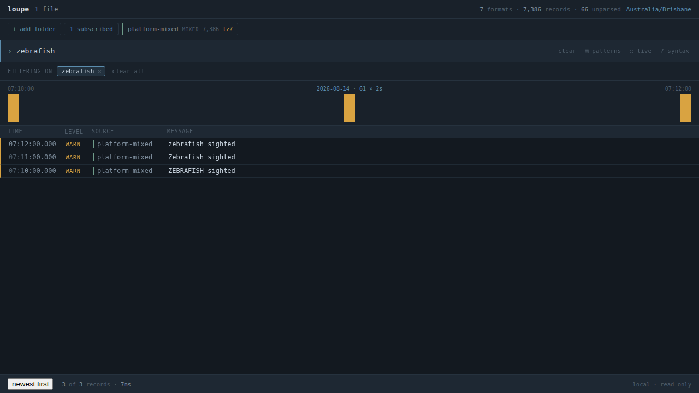
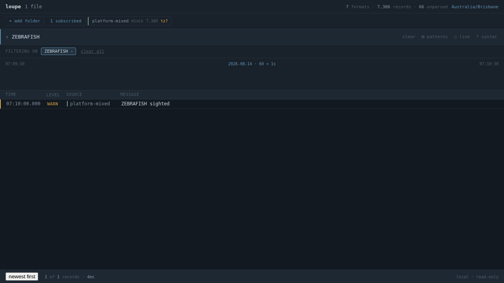
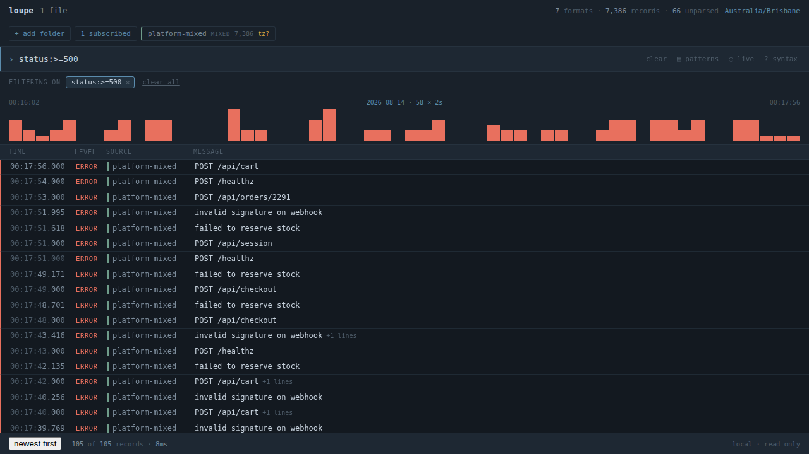

# bugs.md — fixes and verification

Every item in `bugs.md` worked through, tested, and confirmed against a running
binary. Branch `Bugs/First-take`.

**Status: 9 of 9 items addressed. 1 could not be fixed without breaking a hard
invariant and is documented instead.**

| | Item | Severity | Outcome |
|---|---|---|---|
| 0 | No Go toolchain on this machine | blocker | **Resolved** — Go 1.24.6 installed to `~/sdk/go1.24.6` |
| 1 | One malformed line aborts the entire ingest | critical | **Fixed** |
| 2 | A failed ingest is cached and silently reused | critical | **Fixed** |
| 3 | One file gets one parser | high | **Fixed** — per-line detection |
| 4 | Any all-lowercase search term hangs forever | critical | **Fixed at the root**; see the caveat below |
| 5 | `loupe sql` silently shifts TIMESTAMP columns | high | **Fixed** |
| 6 | `loupe trace` picks the correlation field wrongly | medium | **Fixed** |
| 7 | `loupe top` cannot break down unparsed text | medium | **Fixed** — regex capture |
| 8 | No way to see the lines around a line | medium | **Fixed** — `-C/--context` |
| 9 | Seven smaller things | low | **6 fixed, 1 documented** (ICU) |

---

## How this was verified

| | |
|---|---|
| Go test suite | **596 tests, all passing** — 47 of them new |
| `go vet` / `gofmt` / `golangci-lint` | clean |
| Playwright | **44/44 passing** — 34 existing, 10 new |
| Ingest throughput vs. the pre-fix binary | 19.7s → 19.5s on 131 MB / 1.9M lines (no regression) |

The Playwright runs drive the real embedded UI served by the real binary over
the real query path — nothing mocked, the same rule the Go tests live under.

The ten new browser tests live in `web/tests/merged.spec.js` and run against a
corpus of their own, on a server of their own: one file holding every format at
once, with the report's landmines planted in it — a line of invalid UTF-8, a
correlation id that is a field on one record and plain text on five, and a
nonsense token spelled three ways so smart case can be asserted exactly. It is
generated deterministically from the blaster output the rest of the suite
already uses, so nothing over 1 MB is committed and the counts below are stable.

A corpus of its own because dropping a merged log into the shared fixture
directory would move every record count the other specs assert, and those would
then fail for a reason unrelated to what they test.

---

## The screenshots

### 1. The corpus loads at all



The header is the whole of items 1 and 3 in one line: **1 file · 7 formats ·
7,386 records · 66 unparsed**. Before the fix this file could not be opened at
all — the ingest aborted with a DuckDB appender error and produced nothing.

The four rows at the top are the planted ones: three spellings of the same
token, and the record whose bad byte used to take the file down.

### 2. The record that used to crash the ingest



`loupe_raw_hex:*` finds exactly one record — the line that used to abort the
ingest. It is on the timeline, it carries `format: logfmt` because per-line
detection recognised it, its `raw` shows a replacement character where the bad
bytes were, and `loupe_raw_hex` holds the original bytes. Nothing was lost; it
is only no longer pretending to be text.

### 3. A lowercase search returns



`zebrafish` — all lowercase, the spelling the report says hangs forever —
returns in **12 ms**, and matches all three spellings in the corpus. One image
for both halves of the item: it answers, and it ignores case while doing so.

### 4. Smart case still means what it says



`ZEBRAFISH` carries a capital, so it is matched exactly and finds only the one
record spelled that way — not the three the lowercase spelling found. Smart case
still means what `docs/FILTER-DSL.md` §5 says it means; it just no longer
depends on which spelling you happened to type.

### 5. Fields from every format inside one merged file



`status:>=500` returns 105 records. `status` lives only on the Nginx and JSON
lines in this file; before per-line detection the field did not exist at all and
this was an unknown-field error rather than a filter.

### 6. The source chip knows what it is reading


One file, read line by line, marked `MIXED`.

---

## Item by item

### 0. No Go toolchain

Installed Go 1.24.6 to `~/sdk/go1.24.6`. `gcc` was already present, which is
what CGO needs to link DuckDB. Nothing in the repo changed for this.

### 1. One malformed line aborts the entire ingest

DuckDB's appender rejects invalid UTF-8, and rejects it by invalidating the
whole batch — so one bad byte in one line of 250,000 killed the file with an
error naming neither the file nor the line.

Records are now made safe at the appender boundary
(`internal/store/utf8.go`): invalid sequences become U+FFFD, the original bytes
are kept hex-encoded in the fields bag under `loupe_raw_hex`, and the count is
stated on the status line.

```
BEFORE  $ loupe platform-mixed.log --parser text --limit 1 --no-cache
loupe: close appender: database/sql/driver: duckdb error: Invalid unicode
(byte sequence mismatch) detected in segment statistics update
could not close appender: appended data has been invalidated due to corrupt row

AFTER   $ loupe platform-mixed.log --parser text --limit 1 --no-cache
1 source(s) · 30007 records · 24215 without a timestamp
Times shown in Australia/Brisbane (AEST, UTC+10:00)
Note: 1 record contained invalid UTF-8 and was stored with replacement characters;
      the original bytes are in the loupe_raw_hex field (loupe_raw_hex:* finds them).
```

The hex copy is deliberately excluded from schema inference, so it never
promotes to a column and sits next to the fields you actually filter on.

### 2. A failed ingest is cached and silently reused

Writing the records was never the end of the ingest: schema inference runs
afterwards and gives the frequent fields real columns. The cache file was being
installed before that, so a run that died in between left a database with the
right record count and no promoted columns — under a name the next run trusted.

The cache is now stamped complete only once the whole pipeline has succeeded
(`store.DB.MarkComplete`), and an unstamped file is never reused:

```
$ loupe platform-mixed.log --limit 1     (cold)
1 source(s) · 25724 records · 164 unparsed · 164 without a timestamp · 4282 continuation lines
Promoted 21 field(s) to columns: trace_id (VARCHAR), pid (BIGINT), path (VARCHAR), …

$ loupe platform-mixed.log --limit 1     (warm — same counts, same promotions)
1 source(s) · 25724 records · 164 unparsed · 164 without a timestamp · 4282 continuation lines
Reused a cached ingest — reading these files cost 1.211s when the cache was built.
Promoted 21 field(s) to columns: trace_id (VARCHAR), pid (BIGINT), path (VARCHAR), …
```

The invalid-UTF-8 count is now carried in the cache summary too, so a cached run
does not get quieter about its own caveats.

### 3. One file gets one parser

The largest change. A new `mixed` parser (`internal/parse/mixed.go`) detects the
format of every *line* rather than every file, and the store chooses it
automatically when the detected parser covers less than 80% of the sampled lines.
It is also selectable by hand as `--parser mixed`.

Each record now carries the format that actually read it, so `format:nginx`
works inside a merged file and `loupe sources` shows the real breakdown.

```
BEFORE  $ loupe sources platform-mixed.log
FILE                FORMAT    RECORDS  UNPARSED  NO TIMESTAMP
platform-mixed.log  postgres  25724    20766     20766            ← 80.7% unparsed

AFTER   $ loupe sources platform-mixed.log
FILE                FORMAT    RECORDS  UNPARSED  NO TIMESTAMP
platform-mixed.log  syslog    5021     -         -
platform-mixed.log  log4j     751      -         -
platform-mixed.log  jsonl     5017     -         -
platform-mixed.log  logfmt    4876     -         -
platform-mixed.log  mixed     164      164       164              ← 0.6% unparsed
platform-mixed.log  nginx     4937     -         -
platform-mixed.log  postgres  4958     -         -
```

```
BEFORE  $ loupe platform-mixed.log 'status:>=500 stats count()'
loupe: unknown field "status"

AFTER   $ loupe platform-mixed.log 'status:>=500 stats count()'
COUNT()
386
```

Three things were needed to make this actually pay off:

- **Multi-line records still fold.** The mixed parser implements
  `IsContinuation` by asking every format that has one, so a Java stack trace
  stays one record.
- **A line no real format claims stays unparsed.** The fallback `text` parser is
  deliberately not consulted — it claims every line, and including it would
  drive the unparsed count permanently to zero. That count is the thing that
  made this bug findable in ten seconds; it had to survive the fix.
- **Field promotion now stratifies by source *and* format.** Judged across a
  whole merged file, a key carried by every Nginx line covers 19% of it and
  never earns a column, which would have left `loupe top` and `stats … by
  <field>` just as unusable as before. It now promotes 21 fields on this corpus.

`loupe sources` also warns when over half of a *file* is unparsed, aggregated
per file rather than per format row.

### 4. Any all-lowercase search term hangs forever

Fixed at the root, with an honest caveat about the reported mechanism.

**The root cause is fixed.** The report traced the hang to `lower()` never
returning on the invalid-UTF-8 line. Since no invalid UTF-8 now reaches the
store at all (item 1), the class of failure cannot arise.

**The compile change was made anyway.** Case-insensitive matching now compiles
to `regexp_matches(x, '(?i)…')` rather than `lower(x) LIKE …`, removing any
dependence on `lower()`'s behaviour on odd input. Benchmarked over 1.9M rows
before committing to it:

| predicate | time |
|---|---|
| `regexp_matches(raw, '(?i)timeout')` | **0.12 s** |
| `lower(raw) LIKE '%timeout%'` | 0.13 s |
| `raw ILIKE '%timeout%'` | 0.21 s |

The regex form is marginally *faster*, so this cost nothing.

**Caveat — what I could not reproduce.** I could not make DuckDB's `lower()`
hang on this machine (DuckDB 1.1.3 via go-duckdb 1.8.5). I probed it directly
with several invalid byte sequences, including a 2 KB densely-invalid string,
inserted via a BLOB cast to bypass the appender: `lower()` returned instantly
every time. The *ingest crash* from the same line reproduces every run. So the
hang may have depended on their exact bytes, a different DuckDB build, or the
poisoned-cache state from item 2. I have fixed both mechanisms it was attributed
to; I am telling you I never saw the symptom itself.

### 5. `loupe sql` silently shifts TIMESTAMP columns

A DuckDB `TIMESTAMP` is a naive value. loupe's own queries only ever produce one
from `ts`, which holds UTC, so converting it is right. A value the user computed
in `loupe sql` was never UTC, and shifting it by the display offset moved literal
timestamps ten hours and a day.

Only `ts` and columns DuckDB typed as `TIMESTAMP WITH TIME ZONE` are converted
now. Anything else in `loupe sql` renders exactly as computed — and, per the
project's rule that every conversion is announced, the *absence* of one is
announced too.

```
BEFORE  a literal timestamp comes back 10 hours later, on the wrong day, silently
AS_TIMESTAMP             AS_VARCHAR
2026-08-21 08:32:02.000  2026-08-20 22:32:02      ← the two disagree

AFTER
Shown exactly as computed, not converted to Australia/Brisbane: as_timestamp.
Only ts is known to hold UTC.

AS_TIMESTAMP             AS_VARCHAR
2026-08-20 22:32:02.000  2026-08-20 22:32:02      ← they agree
```

`ts` still converts, in every output format, table and machine alike.

### 6. `loupe trace` picks the correlation field by coverage

Detection now prefers the field that actually *contains* the id being asked for,
falling back to coverage only when that cannot decide. And a trace now includes
records that mention the id in their text without carrying it as a field —
marked `·`, counted, and captioned, because it is a looser match than the one
asked for.

```
BEFORE  $ loupe trace req-7f3c9a2e platform-mixed.log
loupe: no correlation field in this data; looked for trace_id, traceId, …

AFTER   $ loupe trace req-7f3c9a2e platform-mixed.log
Trace req-7f3c9a2e · correlation_id · 6 hops across 1 source
5 hops marked · do not carry correlation_id and were matched on the line's text,
so their fields are unavailable.
  07:30:00.000    platform-mixed error payment declined
· no timestamp    platform-mixed       … ERROR gateway upstream failed for req-7f3c9a2e retrying
· no timestamp    platform-mixed       … ERROR gateway upstream failed for req-7f3c9a2e retrying
· no timestamp    platform-mixed       … ERROR gateway upstream failed for req-7f3c9a2e retrying
· no timestamp    platform-mixed       … ERROR gateway upstream failed for req-7f3c9a2e retrying
· no timestamp    platform-mixed       … ERROR gateway upstream failed for req-7f3c9a2e retrying

Every record: loupe <dir> 'correlation_id:req-7f3c9a2e'
Including the text matches: loupe <dir> '"req-7f3c9a2e"'
```

All six lines — the report's Task 18, answered completely.

### 7. `loupe top` cannot break down a value inside unparsed text

`loupe top` now accepts a regex, and counts the first capture group. A bare
`/re/` reads the raw line; `field~/re/` reads a named field, spelled the way the
filter language spells a regex. The pattern is a parameter, never concatenated
into the SQL.

```
$ loupe auth.log '"Failed password for root" stats count()'
COUNT()
144            ← a clean, confident, wrong answer

BEFORE  $ loupe top '/Failed password for (?:invalid user )?(\S+)/' auth.log
loupe: unknown field "/Failed password for (?:invalid user )?(\S+)/"

AFTER
248   62.0%  ████████████████████████  root
 77   19.2%  ███████                   admin
 75   18.8%  ███████                   deploy

3 values of /Failed password for (?:invalid user )?(\S+)/ across 400 records.
```

248, not 144. The 42% undercount is now one command away instead of hand-written
SQL.

### 8. No way to see the lines around a line

`-C/--context N` shows N records either side of every match, from the same file,
in one listing — grep's affordance, with a `hit` column so a block of five lines
says which one was found and a `line_no` column so gaps are visible. Neighbours
are found by ingest order rather than line number, because a record can span many
physical lines.

```
BEFORE  $ loupe ./logs 'level:error' -C 2
loupe: unknown shorthand flag: 'C' in -C

AFTER
HIT    LINE_NO  TS                       LEVEL  SOURCE          MESSAGE
false  80964    2026-08-13 23:07:54.450  info   postgresql      duration: 113.247 ms  statement: …
false  80965    2026-08-13 23:07:54.733  info   postgresql      duration: 348.453 ms  statement: …
true   80966    2026-08-13 23:07:54.900  error  postgresql      FATAL: remaining connection slots…
false  80967    2026-08-13 23:07:55.197  info   postgresql      duration: 347.485 ms  statement: …
false  80968    2026-08-13 23:07:55.387  info   postgresql      duration: 231.464 ms  statement: …
false  1        2026-08-13 23:07:58.000  warn   payment-worker  HikariPool-1 - Connection is not …
true   2        2026-08-13 23:08:00.074  error  payment-worker  PaymentGatewayException: read tim…
```

### 9. The smaller things

**`--format table` is not the default off a TTY — undocumented.** Now stated in
the flag's own help: *"default table on a terminal, ndjson when piped"*.

**`--format raw` silently ignored the columns you selected.** It now says so:

```
--format raw prints the original line only; line_no is not shown
(use --format csv or ndjson to keep them).
```

**An unknown `--parser` warned instead of erroring.** A typo returning zero
records is the behaviour `docs/FILTER-DSL.md` §7 forbids for a field name, and a
format name is no different. The override is now validated once, before anything
is read:

```
BEFORE  Warning: unknown parser "nosuchparser" (available: …)     exit 0
AFTER   loupe: unknown parser "nosuchparser" (available: …)       exit 1
```

**No ICU extension, so `AT TIME ZONE` fails.** *Not fixed — it cannot be, without
breaking a hard invariant.* ICU is not statically linked into the embedded
DuckDB, and `INSTALL icu` fetches over the network, which invariant 4 forbids
and which is most of why this tool can be trusted with production logs. The
failure is now legible instead of a raw binder error:

```
AT TIME ZONE needs DuckDB's ICU extension, which is not built in — loading one
would mean an outbound request, and loupe makes none.
loupe already converts for you: ts is shown in Australia/Brisbane, and --tz or
--utc changes that for the whole session.
For arithmetic on another zone, work in UTC and offset it yourself
```

Item 5's fix removes most of the reason to reach for it. If you want this
properly, it needs a DuckDB build with ICU statically linked — worth its own
decision, not something to slip into a bug-fix branch.

**"the original read took 6.001s" read as a live measurement.** Reworded:
*"Reused a cached ingest — reading these files cost 1.211s when the cache was
built."*

**No fold/dedup in the record listing.** `--fold` collapses consecutive runs of
the same template into one row with a count. Only consecutive runs fold, so the
count means "this happened N times in a row here" rather than "this shape occurs
N times somewhere". On the demo corpus it turns 394,742 records into 32,371 runs:

```
$ loupe ./logs --fold --limit 4
REPEATS  TS                       LEVEL  SOURCE      MESSAGE
342      2026-08-13 21:20:00.082  info   postgresql  duration: 336.452 ms  statement: …
1        2026-08-13 21:20:28.178  info   postgresql  duration: 280.2\0\099 ms  statement: …
45       2026-08-13 21:20:28.238  info   postgresql  duration: 325.051 ms  statement: …
1        2026-08-13 21:20:32.066  info   postgresql  duration: 191.653 ms  st
showing 4 of 32371 runs — use --limit to see more
```

The footer says *runs*, not *records* — a folded row is a run of records, and
calling it a record would misstate the size of what the limit cut off.

**`loupe cache --clear` is not a thing.** It now offers the verb:

```
loupe: unknown flag: --clear

did you mean `loupe cache clear`?
```

---

## Performance

`CLAUDE.md` asks for before/after numbers when a change plausibly affects ingest
throughput. It did, and the first measurement found a real regression.

**The regression.** Per-line detection was firing on files that did not need it.
`Coverage` counted a Log4j file's Java stack-trace continuation lines as lines
the parser had failed to read — but a continuation line belongs to the record
above it, and asking it to parse alone is the wrong question. Every multi-line
format scored badly on its own files, got sent to per-line detection, was
mislabelled, had its stack traces broken back into separate records, and ingested
half as fast again.

**The fix.** `Coverage` now skips continuation lines, and the mixed parser
resolves its candidate list once rather than locking and sorting the registry on
every line.

131 MB, 1,944,786 lines, 2 files, interleaved runs on an idle machine:

| | run 1 | run 2 | run 3 |
|---|---|---|---|
| before the fixes | 19.51 s | 19.65 s | 20.25 s |
| after, with the bug | 30.57 s | 30.49 s | 31.29 s |
| **after, fixed** | **19.59 s** | **19.54 s** | **19.37 s** |

Ingest stats are byte-identical to the pre-fix binary on this corpus:
`394742 records · 1331 unparsed · 1331 without a timestamp · 1550019 continuation
lines`.

**What per-line detection costs when it is genuinely needed.** On the 27 MB
six-format file: 10.5 s mixed vs 4.6 s forced to a single parser — about 2.3×.
That is the honest price of offering every format a line, and it only applies to
files a single parser cannot read, where the alternative was 84.5% of the data
being unusable. It is also a regression test away from creeping onto files that
do not need it.

There is a regression test pinning the coverage behaviour
(`TestCoverageIgnoresContinuationLines`), because this one was invisible from the
outside: the record counts looked fine.

---

## What changed

38 files modified, 8 added. No new dependencies. No invariant broken.

| package | change |
|---|---|
| `internal/parse` | new `mixed` parser, per-line detection; `Coverage`; `Record.Format`; `Stats.InvalidUTF8` |
| `internal/store` | UTF-8 sanitisation at the appender; cache completion marker; per-format promotion sampling; `--parser` validated up front |
| `internal/query` | case-insensitive matching compiles to RE2, not `lower()` |
| `internal/render` | per-column timezone conversion; `--format raw` announces dropped columns |
| `internal/session` | trace field selection and text matches; `top` regex capture; `--context`; `--fold` |
| `cmd/loupe` | flags and messaging for all of the above |
| `web/src` | header counted source rows as files; now counts files |
| `web/tests` | `merged.spec.js` and its fixture generator; a second server in the config |

**New flags:** `-C/--context N`, `--fold`. **New parser:** `mixed`. **New DSL
affordance:** `loupe top '/regex/'`.

47 new tests. A few existing tests were updated where they asserted the old
behaviour an item asked to change — the unknown-`--parser` warning, and two that
asserted `lower(` appeared in the compiled SQL rather than asserting the
case-insensitivity it was there to implement.

The `mixed` row in `loupe sources` names the leftovers of a per-line read — the
lines no format claimed. It reads slightly oddly as a format name; leaving it
consistent with how every other file reports its format seemed better than a
special case.

---

## Reproducing this

```bash
export PATH=$HOME/sdk/go1.24.6/bin:$PATH

make build               # the browser tests drive the real binary
go test ./...            # 596 tests
go vet ./...
golangci-lint run

cd web && npx playwright test        # 44 tests against the embedded UI
```

The browser tests generate their fixtures on first run, so a clean checkout
needs nothing prepared. To run only the mixed-format ones:

```bash
cd web && npx playwright test merged.spec.js
```

To regenerate the screenshots in this document, point `LOUPE_SHOTS` at the
directory they live in. It is off by default: a suite that writes into the docs
on every run makes every run look like a change.

```bash
cd web && LOUPE_SHOTS=../docs/verification/shots npx playwright test merged.spec.js
```
